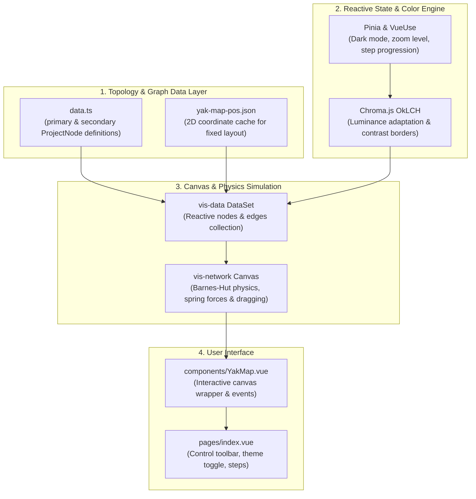

<div align="center">
  
  <h1>🗺️ Tuquet Yak-Map</h1>
  <p><strong>Interactive Visual Dependency Graph, Monorepo Data Flows & Ecosystem Topology</strong></p>

  <p>
    <a href="https://nuxt.com/"></a>
    <a href="https://unocss.dev/"></a>
    <a href="https://visjs.github.io/vis-network/docs/network/"></a>
    <a href="https://github.com/tuquet"></a>
    <a href="https://yarkmap.tuquet.com/"></a>
    <a href="LICENSE"></a>
  </p>

  <p>
    <a href="#-executive-summary">Executive Summary</a> •
    <a href="#-runtime-architecture">Runtime Architecture</a> •
    <a href="#-ecosystem-graph-schema--data-model">Graph Schema</a> •
    <a href="#-quick-start--local-development">Quick Start</a> •
    <a href="#-contributing-nodes--edges">Contributing</a> •
    <a href="#-deployment--github-pages">Deployment</a>
  </p>
</div>

---

## 📋 Executive Summary

**Yak-Map** is an interactive, high-fidelity visual dependency graph and derivation map engineered for the **Tuquet Distributed Automation & AI Agent Ecosystem**. 

As modern systems grow across multiple languages (Rust, TypeScript, Vue 3, Shell) and modular repositories, understanding the topological relationships, architectural derivations, and downstream impacts of changes becomes a significant challenge. **Yak-Map** solves this by mapping:

1. **The 14 Ecosystem Repositories**: Complete inter-connectivity between upstream foundational engines (`tuquet/runner`, `tuquet/cli`, `tuquet/browser`), intermediate orchestrators (`tuquet/automa`, `tuquet/cloud`), AI tooling (`tuquet/claude-agy`, `tuquet/skills`), and operational runbooks.
2. **Monorepo Package Hierarchies**: Internal derivations and shared libraries within `@tuquet/lib` (`vue-ui`, `vue-table`, `md-export`, `extension-runner`, `lunar`).
3. **Data Flow & Control Pipelines**: Explicit directed connections showing how cloud commands, daemon supervision, browser actions, and telemetry flow through the architecture.

```
┌─────────────────────────────────────────────────────────────────────────────┐
│                           YAK-MAP CAPABILITIES                              │
├────────────────────────┬──────────────────────────┬─────────────────────────┤
│   14 Repositories Map  │  Interactive Force Canvas│   Zero-Friction Tour    │
│ Topological graph view │ Barnes-Hut 2D physics    │ Guided step progression │
├────────────────────────┼──────────────────────────┼─────────────────────────┤
│    Dual-Tier Filters   │  OkLCH Perceptual Colors │  100% Static Web SSG    │
│ Primary Core / Packages│ Dark/Light mode adapt    │ GitHub Pages zero-host  │
└────────────────────────┴──────────────────────────┴─────────────────────────┘
```

---

## 🏗️ Runtime Architecture

Yak-Map is built as a ultra-lightweight, reactive Single Page Application (SPA) statically generated via Nuxt 4 and Nitro:



### Key Technical Characteristics
- **Nuxt 4 & Nitro**: Fast build times, file-based routing, instant auto-imports, and static site pre-rendering (`nuxi generate`).
- **UnoCSS Engine**: On-demand utility engine providing instant styling with zero CSS runtime overhead.
- **Vis Network**: Canvas-based 2D force-directed physics engine handling smooth drag, zoom, node selection, and cluster navigation.
- **Perceptual Color Science**: OkLCH color space manipulation through `chroma-js` to dynamically balance luminance, saturation, and contrast against both light and deep-dark (`#050505`) backgrounds.

---

## 🧭 Ecosystem Graph Schema & Data Model

The graph topology is defined as TypeScript structures in [`data.ts`](./data.ts) (or split into `app/data/nodes.ts` and `app/data/edges.ts` when scaling):

### 1. `ProjectNode` Schema

```typescript
export interface ProjectNode extends Partial<Node> {
  name: string          // Unique repository or package identifier (e.g. 'tuquet/runner')
  display?: string      // Human-friendly title rendered on the node label
  link: string          // External GitHub repository or documentation URL
  color?: string        // Categorical hex color from the palette
  from?: string[]       // Upstream origin nodes (creates directed solid arrows: from -> node)
  deps?: string[]       // Peer/Downstream dependencies (creates dashed physics-free links)
  dashed?: boolean      // Render dashed border (used for distribution buckets, config manifests)
  faded?: boolean       // Visual fading for secondary sub-packages
  x?: number            // Explicit X coordinate
  y?: number            // Explicit Y coordinate
  animateStop?: boolean // Stop point flag during step-by-step presentation mode
}
```

### 2. Canonical Color Palette

| Category | Color Code | Scope |
| :--- | :--- | :--- |
| **CLI** | `#3b82f6` (Blue) | Unified Master CLI, Scoped Shell, and Scoop Distribution. |
| **Runner** | `#ef4444` (Red) | Rust Universal Runner, Win32 Job Object Supervisor, Daemon. |
| **Automa** | `#f59e0b` (Amber) | Automa DAG Engine, Drawflow Studio, MV3 Runner. |
| **Browser** | `#f97316` (Orange) | Chromium LTS Sandboxing, Fingerprint Protection. |
| **Cloud** | `#10b981` (Green) | Supabase Control Plane, Multi-Tenant Database, Edge Functions. |
| **Bot** | `#14b8a6` (Teal) | Telegram Ops Daemon, Real-Time Alerts. |
| **Lib** | `#06b6d4` (Cyan) | Shared TypeScript Monorepo (`@tuquet/vue-ui`, `@tuquet/vue-table`, etc.). |
| **Claude / AI** | `#8b5cf6` (Purple) | Claude-Agy Proxy Bridge, Antigravity Agent Skills. |

---

## ⚡ Quick Start & Local Development

### Prerequisites
- **Node.js**: `>= 20.x`
- **pnpm**: `>= 10.x`

### 1. Install Dependencies
```bash
pnpm install
```

### 2. Start Local Development Server
```bash
pnpm run dev
```
Navigate to `http://localhost:3000` to interact with the map in real time. Hot Module Replacement (HMR) automatically reflects edits in `data.ts` and UI components.

### 3. Verification & Code Quality
```bash
# Typecheck TypeScript definitions
pnpm run typecheck

# Lint codebase with ESLint
pnpm run lint
```

### 4. Build & Preview
```bash
# Build production server bundle
pnpm run build

# Generate static HTML export for GitHub Pages (.output/public)
pnpm run generate

# Preview generated static build locally
pnpm run start:generate
```

---

## 🤝 Contributing Nodes & Edges

When a new repository, package, or tool is added to the Tuquet ecosystem, follow this workflow to include it on the map:

### 1. Add Node Definition to `data.ts`
Open [`data.ts`](./data.ts) (or `app/data/nodes.ts`):

```typescript
// For a primary top-level platform repository:
export const primary: ProjectNode[] = [
  // ... existing nodes
  {
    name: 'tuquet/my-new-service',
    display: 'my-service (High-Performance Engine)',
    link: 'https://github.com/tuquet/my-new-service',
    color: colors.runner,
    from: ['tuquet/cli'],              // Connected upstream source
    deps: ['tuquet/cloud'],            // Additional dependency links
  },
]

// Or for a secondary monorepo package or tooling library:
export const secondary: ProjectNode[] = [
  // ... existing nodes
  {
    name: 'tuquet/my-package',
    display: 'my-package (Utility)',
    link: 'https://github.com/tuquet/lib/tree/main/packages/my-package',
    color: colors.lib,
    from: ['tuquet/lib'],
  },
]
```

### 2. Adjust Layout Coordinates (`yak-map-pos.json`)
- If automatic force simulation places the node appropriately, you do not need to manually specify coordinates.
- To lock a precise coordinate:
  1. Set `isEditing: true` in `pages/index.vue` or enable drag mode.
  2. Drag the node to the desired position on the canvas.
  3. Export or copy the new `{ x, y }` coordinates into [`yak-map-pos.json`](./yak-map-pos.json) under the node's `name` key.

### 3. Verify Connections
- Run `pnpm run dev` and ensure:
  - Solid arrows (`from`) point cleanly from parent to child.
  - Dashed lines (`deps`) connect cross-cutting dependencies without physics tangling.
  - Node links redirect to the correct GitHub repository or documentation page.

---

## 🚀 Deployment & GitHub Pages

Yak-Map is continuously deployed to GitHub Pages via GitHub Actions:

- **Workflow**: [`.github/workflows/deploy-pages.yml`](.github/workflows/deploy-pages.yml)
- **Trigger**: Every push or merge to the `main` branch.
- **Base URL**: `https://yarkmap.tuquet.com/` (configured through `NUXT_APP_BASE_URL: /`).
- **Hosting**: 100% Serverless, static HTML/JS/CSS assets served directly via GitHub Pages CDN.

---

## 📄 License

Distributed under the **MIT License**. Derived and adapted from Anthony Fu's Yak Map under the MIT License.
